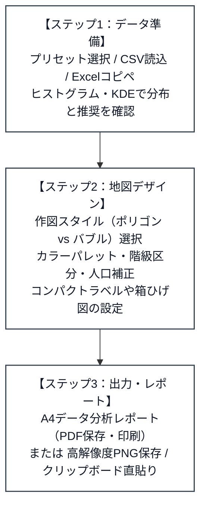

# 青森県市町村コロプレスツール 利用者マニュアル＆リファレンス

本ツールは、青森県内全40市町村の各種統計データ（人口、面積、産業、労働、医療、福祉、財政など）から、美しく見やすい色分け地図（コロプレスマップ）およびバブル塗り分けマップを直感的に作成・分析・エクスポートできるWebアプリケーションです。

データは外部サーバーへ一切送信されず、すべてお使いのWebブラウザ内（ローカル環境）で安全かつ高速に処理されます。

---

## 📌 目次
1. [本ツールの特長](#1-本ツールの特長)
2. [動作環境・起動方法](#2-動作環境起動方法)
3. [クイックスタート（基本操作フロー）](#3-クイックスタート基本操作フロー)
4. [データ読み込み ＆ 統計分析（ステップ1）](#4-データ読み込み--統計分析ステップ1)
   - [データ取り込み（3通りの方法）](#4-1-データ取り込み3通りの方法)
   - [「単位」と「出典」行の自動認識・反映](#4-2-単位と出典行の自動認識反映)
   - [公的統計基準に準拠した「0」と「欠測・秘匿（X / - / …）」の厳密な区別](#4-3-公的統計基準に準拠した0と欠測秘匿x-----の厳密な区別)
   - [統計分布（度数ヒストグラム ＆ カーネル密度推定：KDE）と自動判定アドバイス](#4-4-統計分布度数ヒストグラム--カーネル密度推定kdeと自動判定アドバイス)
   - [多変量データの一括選択・市町村名自動ゆらぎ補正](#4-5-多変量データの一括選択市町村名自動ゆらぎ補正)
5. [マップデザイン ＆ レイアウト設定（ステップ2）](#5-マップデザイン--レイアウト設定ステップ2)
   - [作図スタイル（ポリゴン塗り分け vs バブル塗り分け）](#5-1-作図スタイルポリゴン塗り分け-vs-バブル塗り分け)
   - [バブル塗り分けの詳細設定（サイズ方式・重なり回避・表記スタイル）](#5-2-バブル塗り分けの詳細設定サイズ方式重なり回避表記スタイル)
   - [数値変換・分析モード（実測値 / 人口補正 / Zスコア / 偏差値）](#5-3-数値変換分析モード実測値--人口補正--zスコア--偏差値)
   - [カラーパレット ＆ 白黒印刷向けパターン（ハッチング）](#5-4-カラーパレット--白黒印刷向けパターンハッチング)
   - [階級区分法（Jenks自然分類・等間隔・分位数）](#5-5-階級区分法jenks自然分類等間隔分位数)
   - [地図上の市町村ラベル（コンパクト表示 ＆ 有界フォースレイアウト）](#5-6-地図上の市町村ラベルコンパクト表示--有界フォースレイアウト)
   - [マップ内「箱ひげ図（ボックスプロット）」による分散可視化](#5-7-マップ内箱ひげ図ボックスプロットによる分散可視化)
   - [凡例（レジェンド）の自動構成](#5-8-凡例レジェンドの自動構成)
6. [結果のエクスポート ＆ レポート出力](#6-結果のエクスポート--レポート出力)
   - [📄 A4データ分析レポート出力（PDF保存・印刷対応）](#6-1-a4データ分析レポート出力pdf保存印刷対応)
   - [📥 高解像度マップ画像保存 (PNG)](#6-2-高解像度マップ画像保存-png)
   - [📋 クリップボードへ直接画像コピー](#6-3-クリップボードへ直接画像コピー)
   - [📁 変換後データのCSV書き出し](#6-4-変換後データのcsv書き出し)
7. [よくある質問（FAQ）](#7-よくある質問faq)
8. [ディレクトリ構成と使用ライブラリ](#8-ディレクトリ構成と使用ライブラリ)

---

## 1. 本ツールの特長

* 🔒 **安心の完全ローカル処理**: データを外部サーバーに送信しないセキュア設計。独自調査データや機密内部資料も安全に扱えます。
* 📄 **1枚にまとまるA4データ分析レポート出力（PDF保存・印刷対応）**:
  - 地図画像、基本統計サマリー（純粋な8基本統計量）、自治体ランキング（上位・下位各10自治体）、データ分布図（ヒストグラム ＆ 度数換算KDE曲線）、備考・出典をA4用紙1枚にスマート集約。
  - **横置き（Landscape）**と**縦置き（Portrait）**をワンクリックで自在に切り替え可能。
  - 印刷（プリント）時にトナー汚れやモヤつきが出ない**「白背景・黒灰線」**のクリーンで品格ある印刷デザイン。
* 🫧 **面積バイアスを完全解消する「バブル塗り分け」機能**:
  - ポリゴン塗り分け特有の「面積の広い自治体（むつ市・十和田市等）が過大に目立ち、狭小な自治体が見落とされる」問題を解消。
  - 各自治体を円形シンボルで配置し、弘前市周辺など密集自治体の**重なり回避（物理シミュレーション）**と**引き出し線（リーダーライン）**を自動描画。
  - **4つのサイズ方式**（均一、階級ステップ連動の段階シンボル図、数値比例、人口比例）を自在に切り替え可能。
* 📊 **豊富なプリセットデータ（100指標以上収録）**: 「令和8年 青森県統計年鑑 市町村データ100」および「総務省統計局 統計でみる市区町村のすがた 2026（89指標）」を標準収録。ワンクリックで即座に作図・比較できます。
* 📋 **Excel / Web表のコピペ・CSV一括読み込み**: 表データをコピー＆ペーストするだけで自動認識。市町村名の省略（「弘前」→「弘前市」等）や「単位」「出典」行も全自動でパースされます。
* 🛡️ **統計的完全性（0と欠測・秘匿の厳密な区別）**: 公的統計の基準に準拠し、「0（実績値ゼロ）」と「X（秘匿）」「-（欠測・該当なし）」を明確に分離。誤認（ミスリード）のない中立色・破線枠・独立凡例で表現します。
* 📈 **統計的に厳密なKDE密度曲線 ＆ マップ内箱ひげ図**:
  - ヒストグラムとカーネル密度推定（KDE）曲線を**度数スケール換算（Expected Count Density）**で同一Y軸に整合描画。
  - 地図上には集団の分散を示すボックスプロットを同時描画し、マウスホバーでリアルタイム連動。
* 🏷️ **領域内に綺麗に収まるスマートラベル**: 田舎館村や藤崎町など狭小自治体のラベルが海や県外に飛び出さない「有界フォースレイアウト（変位制限）」と、すっきり収容できる「コンパクト表示」を搭載。
* 🎨 **多彩な配色 ＆ 白黒印刷対応**: カラーグラデーション、Zスコア専用の発散型パレットに加え、白黒論文や公的報告書向けのSVGハッチング（斜線・点模様）も完備。
* 🖼️ **高解像度PNG保存 ＆ クリップボード直貼り**: プレゼン資料や報告書へワンクリックで高精細PNG書き出し、または直接貼り付け（Ctrl+V）コピーが可能です。

---

## 2. 動作環境・起動方法

特別なソフトウェアのインストールは不要です。モダンブラウザと開発環境（または静的配信サーバー）があれば動作します。

1. **推奨ブラウザ**: Google Chrome, Microsoft Edge, Mozilla Firefox, Safari
2. **起動・開発手順**:
   - 開発モードでの起動（Vite開発サーバー）:
     ```bash
     npm run dev
     ```
     ブラウザで `http://localhost:5173` にアクセスして開発・確認が行えます。
   - 配信用単一HTMLファイルの生成（ビルド）:
     ```bash
     npm run build
     ```
     生成された `dist/index.html`（または `dist/` フォルダ全体）をダブルクリックするかサーバーに配置するだけで、オフライン環境・Webサーバー上の双方で完全動作します。

---

## 3. クイックスタート（基本操作フロー）



| ステップ | 操作内容 | 主な機能・ポイント |
| :--- | :--- | :--- |
| **ステップ1：データ準備** | プリセット選択 / CSV読込 / Excelコピペ | 100指標プリセット、全自動パース、単位・出典抽出、度数ヒストグラム ＆ KDE密度曲線、歪度診断 |
| **ステップ2：地図デザイン** | スタイル選択 ＆ 統計表現の調整 | ポリゴン／バブル塗り分け、人口補正・Zスコア変換、カラーパレット、Jenks自然分類、有界コンパクトラベル、箱ひげ図 |
| **ステップ3：出力・レポート** | レポート発行 ＆ 高解像度保存 | **A4データ分析レポート（PDF保存・印刷）**、高解像度PNG保存、クリップボード直貼り、CSV書き出し |

---

## 4. データ読み込み ＆ 統計分析（ステップ1）

### 4-1. データ取り込み（3通りの方法）

操作パネル上部の「① データの読み込み・選択」から、以下の3通りの方法でデータを読み込めます：

1. ✨ **プリセットデータから選ぶ**:
   - **R8青森県統計年鑑 市町村データ100**（面積、人口、産業、製造品出荷額、医療、財政など100指標）
   - **総務省統計局「統計でみる市区町村のすがた 2026」**（主要89社会経済指標）
2. 📁 **CSV / Excelファイルから読み込む**:
   - `.csv`, `.tsv`, `.xlsx` ファイルをドラッグ＆ドロップするか、「ファイルを選択」から指定します。
3. 📋 **テキスト一括貼り付け（コピー＆ペースト）**:
   - Excelのセル範囲やWebブラウザ上の表を範囲選択してコピー（Ctrl+C）し、入力枠へ貼り付け（Ctrl+V）後、「データを解析して反映」を押します。

### 4-2. 「単位」と「出典」行の自動認識・反映

CSVやExcelデータに含まれる「単位」や「出典」情報を高精度に自動抽出し、画面や地図上に反映します。

1. **明示的な「単位」行の最優先取得 ＆ 属性カッコの誤認防止**:
   - CSV内に「単位」行（例: `単位,才,才` や `単位,人,百万円`）が存在する場合、それを最優先で各項目の単位として自動取得します。
   - `平均寿命（男）` や `受給者数（女）`、`総人口（2020年）` のように列名にカッコが含まれていても、「男」「女」「男女計」「総数」「全体」「計」などの性別・属性区分や年号を単位として誤認しない安全フィルターを備えています。
   - 単位行が存在しない場合のみ、列名末尾のカッコ（例: `総面積（k㎡）` → `k㎡`）から適切な単位をフォールバック抽出します。
2. **多様な「出典」フォーマットの柔軟な自動認識**:
   - 自治体名列に「出典」「データ出典」「ソース」「備考」とある標準的な形式だけでなく、**自治体名列が空欄で各指標列に出典名（例: `,令和２年市区町村別生命表,令和２年市区町村別生命表`）が直接記載されている形式**もメタデータ行として高精度に自動検出します。
   - `※出典：` や `出典:` などのコロン・記号付き表記にも対応。
   - 抽出された出典情報は、地図下部の備考欄に `※ 出典：〇〇` の統一形式で自動設定されます。
3. **都道府県・集計行（「県」「県計」「合計」「全国」等）の自動スキップ**:
   - データ中に含まれる `県`、`青森県`、`県計`、`合計`、`全国` などの集計行は自治体データ処理から自動的に除外されます。市町村マッチングのエラーや未マッチ警告レポートに混入することはありません。
4. **行末カンマ（空列）の自動クリーンアップ**:
   - 表計算ソフト等からのCSV書き出し時に発生しやすい行末の余分なカンマ（空文字のカラム名）を自動除外します。

### 4-3. 公的統計基準に準拠した「0」と「欠測・秘匿（X / - / …）」の厳密な区別

公的統計（総務省統計局など）において、「0（実績値がゼロ）」と「X（秘匿）」「-（皆無・該当なし）」は全く異なる意味を持ちます。本ツールでは読者の誤解を防ぐため、以下のように厳密に区別して処理します：

| 記号・値 | 統計上の意味 | 本ツールでの地図表現 | 凡例・詳細カードでの扱い |
| :--- | :--- | :--- | :--- |
| **0** | **実績値がゼロ**<br>（例: 死亡者数0人、該当施設0件） | 通常の第1階級（最も薄い青など）の実測値として塗り分け | 通常の数値階級として表示 |
| **X** | **秘匿（秘密保護）**<br>（企業数が少なく特定されるため非公開） | **中立スレートグレー**（`#cbd5e1`）＋**破線（点線）枠** | 凡例に「■ 秘匿 (X)」を独立表示。<br>クリック時に「※秘密保持のため非公開（集計対象外）」と明記 |
| **-** / **…** | **欠測・該当なし・不詳**<br>（対象が存在しない、計算不能） | **薄い中立グレー**（`#e2e8f0`）＋**破線（点線）枠** | 凡例に「■ 欠測・該当なし」を独立表示。<br>クリック時に「※統計集計対象外」と明記 |

> [!IMPORTANT]
> **統計分析への影響防止**:
> 秘匿（X）や欠測（-）は、平均値・中央値・四分位数・標準偏差・箱ひげ図・Jenks分類の**計算母数から厳密に除外**されます。これにより、「秘匿を0として計算して平均値が不当に下がる」といった分析の誤りを完全に防止します。

### 4-4. 統計分布（度数ヒストグラム ＆ カーネル密度推定：KDE）と自動判定アドバイス

データを読み込むと、選ばれた指標の度数分布ヒストグラムとカーネル密度推定（KDE）曲線が同一の度数軸（自治体数）上に整合描画されます。
- **統計的に正しい度数スケール換算（Count-Scaled KDE）**:
  - ガウスカーネルおよびSilverman則（Silverman's rule of thumb）による最適な平滑化バンド幅で密度関数 $f(x)$ を推定。
  - 確率密度を「総データ数 $n$ × ビン幅 $W$」でスケーリング換算することで、**ヒストグラムの柱の面積合計とKDE曲線下の総面積が厳密に一致**し、同一の度数軸（Y軸）上で直接比較・解釈できます。
- **統計サマリー**: 有効データ数、最小値、最大値、平均値、中央値、歪度（Skewness）をリアルタイム計算。
- **自動判定アドバイス**:
  - **① 数値変換アドバイス**: データの偏りや指標の性質（実数・総数か、割合・率か）を自動診断し、「100人あたり(%)への人口補正」や「Zスコア/偏差値変換」が推奨される場合は理由付きで提案します。
  - **② 階級区分法アドバイス**: 分布の左右非対称性や飛び離れた値の有無に基づき、「Jenks自然分類法」または「等間隔分類」のどちらが適切かを推薦します。

### 4-5. 多変量データの一括選択・市町村名自動ゆらぎ補正

- **変数の切り替え**: 複数列を含むデータを読み込んだ場合、ヘッダー部やサイドバーのドロップダウン、または「変数を選択」モーダルからワンクリックで切り替えられます。
- **強力な市町村名正規化エンジン**:
  - 市町村名の「市・町・村」の省略（例: 「黒石」→「黒石市」、「板柳」→「板柳町」）
  - ひらがな・カタカナ表記（例: 「おいらせ」→「おいらせ町」、「ひろさき」→「弘前市」）
  - ヶ/ケ/ガの表記ゆれ（例: 「鰺ケ沢町」→「鰺ヶ沢町」、「三戸」→「三戸町」）
  を自動判定・補正し、マッチング結果レポートを表示します。
- **集計行（県・全国・合計）の自動識別**:
  - 「県」「青森県」「県計」「合計」「全国」などの集計行を自動判別し、未マッチ自治体警告から自動除外します。

---

## 5. マップデザイン ＆ レイアウト設定（ステップ2）

### 5-1. 作図スタイル（ポリゴン塗り分け vs バブル塗り分け）

用途や分析目的に応じて、2つの作図スタイルをワンクリックで切り替えることができます：

1. **🗺️ ポリゴン塗り分け（標準コロプレスマップ）**:
   - 各市町村の行政境界ポリゴンそのものを統計値に応じた階級色で塗り分けます。
   - 地理的な広がりや隣接関係をそのまま視覚化する伝統的な地図表現です。
2. **🫧 バブル塗り分け（面積バイアス解消マップ）**:
   - 各市町村の重心位置に円形シンボル（バブル）を配置し、バブルの塗色（およびサイズ）で数値を表現します。
   - ポリゴン塗り分けの弱点である**「面積の大きな自治体（むつ市・十和田市等）が過度に目立ち、面積の小さな自治体（弘前市周辺等）が見落とされる」視覚バイアスを解消**します。下層には淡いグレーの境界線が表示されるため、地理的位置も明確です。

### 5-2. バブル塗り分けの詳細設定（サイズ方式・重なり回避・表記スタイル）

バブル塗り分け選択時には、以下の多彩なカスタマイズが可能です：

#### ① バブルサイズの4つの方式
| サイズ方式 | 特徴と活用場面 |
| :--- | :--- |
| **均一サイズ (42px)** | 全40市町村のバブルを同じ大きさで整然と描画します。<br>面積差による先入観を完全に排除し、**純粋に色（階級）の差だけで比較**したい場合に最適です。 |
| **階級ステップ連動 [推奨]** | 選択中の**階級区分（例: 5段階）のステップ番号（1〜5）に連動してバブル直径を段階的に変化**させます（段階シンボル図 / Graduated Symbol Map）。<br>色の濃淡に加えてバブルの大きさでも階級の違いが強調されるため、直感的な把握が容易になります。 |
| **数値比例（連続変化）** | 統計数値の最小値〜最大値に正確に比例してバブルの直径が連続的に変化（20px〜56px）します。<br>最大値と最小値の絶対的な差をダイレクトに視覚化したい場合に適しています。 |
| **人口比例** | 各市町村の人口規模（令和7年国勢調査速報値）に比例してバブルの直径が変化（20px〜56px）します。<br>「人口重み付け表現」として、人口の集中度合いを加味した分析に便利です。 |

#### ② 密集地域の重なり回避（物理シミュレーション）と引き出し線
- 弘前市周辺（弘前市、黒石市、平川市、藤崎町、大鰐町、田舎館村など）の狭小な密集地域では、バブル同士が重なって見えづらくならないよう、**反発力と復元引力による衝突回避力学シミュレーション**を自動実行します。
- 周辺の空きスペース（岩木山麓や平野部）へ自然に分散配置され、元の市町村重心から大きく移動したバブルには、所属する市町村を示す**細い点線の引き出し線（リーダーライン）**が自動描画されます。

#### ③ バブル内文字と表記スタイル（地域差のない均一表示）
- **表示内容の切り替え**:
  - 「自治体名のみ」「自治体名＋数値」「文字なし」を選択可能。
- **団体名表記スタイル**:
  - **正式名称**: 「五所川原市」「おいらせ町」などのフルネーム表示。文字数（3〜5文字）に応じてフォントサイズと文字詰め（letter-spacing）を動的に自動調整し、枠外へのはみ出しを防止します。
  - **簡略表記（推奨）**: 「五所川原」「おいらせ」「弘前」「田舎館」のように市町村サフィックスを省略。文字数のばらつきが抑えられ、**すべての自治体で統一感のある美しい余白バランス**が実現します。
- **高コントラスト文字色**:
  - バブルの背景色の輝度を自動計算し、淡い色のバブルにはダーク文字、濃い色のバブルにはホワイト文字を自動適用するため、視認性が常に保たれます。

### 5-3. 数値変換・分析モード（実測値 / 人口補正 / Zスコア / 偏差値）

目的に応じて以下の統計変換を瞬時に適用できます：
- **実測値（そのままの数値）**: 入力された原数値をそのまま色分けします。
- **人口100人あたり（％）**: 自治体の基準人口（総務省統計局「令和7年国勢調査 人口速報集計」）で割り、人口100人あたりの数値に換算（人口規模の格差を相殺）。
- **人口1,000人あたり / 1人あたり**: それぞれ1,000人・1人あたりの値に換算。
- **Zスコア（標準化偏差 : 平均=0, SD=1）**: 全体平均を0、標準偏差を1とした相対的な乖離度合いに変換。
- **偏差値（Tスコア : 平均=50, SD=10）**: 受験や能力指標でおなじみの平均50、標準偏差10の尺度に変換。

### 5-4. カラーパレット ＆ 白黒印刷向けパターン（ハッチング）

- **標準カラーパレット**: ブルー（単色系）、グリーン、オレンジ、レッド、パープル、Viridis、Cividis、Magma、Spectralなど。
- **白黒印刷・学術論文向けパターン（SVGハッチング）**:
  - モノクロ印刷や白黒コピーでも階級の差が明確に判別できるよう、斜線・格子・ドット・クロスハッチなどのSVG模様で塗り分けるモードを搭載。
- **発散型パレット（Diverging）**:
  - Zスコアや偏差値選択時に推奨されるパレット（青-赤、赤-青、茶-青緑など）。平均値（0または50）を中間色の白・淡色とし、高低両極を鮮やかに際立たせます。

### 5-5. 階級区分法（Jenks自然分類・等間隔・分位数）

- **Jenks（自然段階分類法）[推奨]**: データの自然なクラスタ（谷間）を検出し、グループ内のばらつきを最小化・グループ間の差異を最大化する境界を自動計算します。
- **等間隔分類（Equal Interval）**: 最小値から最大値までを均等な数値幅で分割します。
- **分位数分類（Quantile）**: 各階級に含まれる自治体数が均等（40自治体の5階級なら各8自治体）になるように分割します。
- **カスタム境界**: ユーザーが任意の境界数値を指定して自由に区分することも可能です。

### 5-6. 地図上の市町村ラベル（コンパクト表示 ＆ 有界フォースレイアウト）

ポリゴン塗り分け時の市町村名・数値ラベルは、用途に合わせて以下の4つのスタイルから選べます：

1. **表示しない（クリーンな地図）**: 地図の純粋なグラデーションのみを見せたい場合に最適。
2. **主要10市のみ表示（すっきり・重なりなし）**: 県内の主要10市のみをピックアップ表示。
3. **全40自治体 コンパクト表示（推奨：領域内にスマート収容）**:
   - 市町村名と数値を1行のインライン形式（例: `田舎館 7.3千`）にスリム化。
   - 田舎館村や藤崎町などの狭小自治体でも、引き出し線を出さずに自治体領域内に綺麗に収まります。
4. **全40自治体 標準表示（領域制限・重なり自動調整）**:
   - 市町村名と数値を2段組で表示。大きく位置調整された場合のみ細い点線の引き出し線を表示します。

> [!TIP]
> **有界フォースレイアウト（Bounded Force-Directed Layout）**:
> 本ツールの自動重なり回避アルゴリズムには「重心からの最大移動距離制限（クランプ）」と「焼きなまし減衰」が組み込まれており、ラベルが海（日本海・陸奥湾）や県外へ吹き飛んでしまう現象を物理的に防止しています。

### 5-7. マップ内「箱ひげ図（ボックスプロット）」による分散可視化

地図上の凡例と反対側の位置（空きスペース）に、データのばらつき度合いを示す**ミニ箱ひげ図**を自動描画できます：
- **構成要素**:
  - 外れ値を含む最小値（Min）、第1四分位数（Q1）、中央値（Median）、第3四分位数（Q3）、最大値（Max）。
  - 右側に現在のカラーパレットの階級区分カラーバーを配置し、箱ひげ図の各位置がどの階級色に対応しているかを視覚的にリンク。
- **マップ連動ハイライト**:
  - 地図上の自治体（またはバブル）にマウスを乗せると、箱ひげ図上に対応する数値の位置を示す点線と数値バッジがリアルタイムに出現します。
- **オン/オフ・配置設定**:
  - チェックボックスで表示/非表示を切り替え可能。配置は凡例の位置に応じて「自動（凡例の反対側の中段）」に最適配置されます。

### 5-8. 凡例（レジェンド）の自動構成

- **数値階級バー**: 各階級の数値範囲（例: `1.2万 ～ 3.5万`）と該当する自治体数カウントバッジを表示。
- **特殊値（秘匿・欠測）の独立表示**:
  - 秘匿（X）や欠測（-）が存在する場合、階級バーの下部に破線区切りで「■ 秘匿 (X)」「■ 欠測・該当なし」が自動的に追加されます。
- **配置位置の変更**: 右中、右上、右下、左中、左上、左下から自由に配置を変更できます。

---

## 6. 結果のエクスポート ＆ レポート出力

本ツールでは、作成した地図や分析結果をプレゼンテーション、配布資料、公的報告書、学術論文などにすぐ活用できるよう、多彩な出力形式を用意しています。

### 6-1. 📄 A4データ分析レポート出力（PDF保存・印刷対応）

操作画面上部の「**📄 A4レポート出力**」ボタンを押すと、現在の分析結果をA4用紙1枚に美しくレイアウトしたレポートプレビューモーダルが起動します。

```text
┌─────────────────────────────────────────────────────────────┐
│ 【A4レポートの構成要素】                                      │
│  1. ヘッダー: レポート表題、指標名、単位、作成日               │
│  2. 地図エリア: 現在の描画スタイル（ポリゴン/バブル）の高解像度地図 │
│  3. データ分布図: 度数ヒストグラム ＆ カーネル密度推定(KDE)     │
│  4. 基本統計サマリー: 8大基本統計量（対象数/合計/平均/中央値等） │
│  5. 自治体ランキング: 上位10自治体 ＆ 下位10自治体一覧         │
│  6. 備考・出典: 出典情報や分析注記、フッター表記               │
└─────────────────────────────────────────────────────────────┘
```

#### ① 横置き（Landscape）＆ 縦置き（Portrait）の即時切り替え
- モーダル上部のトグルボタン（「横置き A4」「縦置き A4」）で、提出先やファイリング形式に合わせた最適なレイアウトへ瞬時に切り替えられます。
- **横置き（Landscape）**: 地図をワイドに表示したい場合や、スライド資料・横型配布レジュメに最適です。
- **縦置き（Portrait）**: 縦型ファイル綴じや報告書・白書への差し込みに最適な伝統的レイアウトです。

#### ② 統計的に厳密なデータ分布図（十分な高さを確保）
- 縦横どちらの用紙向きでも、度数分布の山谷が潰れない**十分な高さ（118px〜130px）**を確保。
- ガウス核・Silverman則によるカーネル密度推定（KDE）曲線を**度数スケール換算（Expected Count Density）**で重畳。ヒストグラムの棒グラフとKDE曲線が同一の度数軸（自治体数）上で厳密に比較できます。
- 平均値・中央値のリファレンス破線、最小・最大値、度数軸目盛り線を完備。

#### ③ 純粋な基本統計量に特化したサマリーテーブル
- 「対象自治体数」「合計」「平均値 (Mean)」「中央値 (Median)」「最大値 (Max)」「最小値 (Min)」「標準偏差 (SD)」「四分位範囲 (IQR)」の**8大基本統計量のみを厳選表示**。
- コロプレスマップ固有の階級区分手法（Jenks等）は除外され、統計資料として客観的でブレのない数表を提供します。

#### ④ 自治体ランキング（上位・下位各10自治体）
- 全40自治体の中から、上位10自治体と下位10自治体をコンパクトな2段組テーブルで一覧表示。地域の突出値や底打ち傾向が一目で分かります。

#### ⑤ 印刷（プリント）に最適化した「白背景・黒灰線」クリーンデザイン
- 背景の薄青着色や不透明塗りつぶしを徹底排除し、**純白背景（#ffffff）とシャープな黒〜灰色の境界線・グリッド線**で構成。
- トナーの無駄な消費やカラー印刷時のモヤつき・色ムラを防止し、モノクロレーザープリンタや白黒コピー機でも鮮明に出力されます。
- ブラウザの印刷機能（`Ctrl+P` または「印刷 / PDF保存」ボタン）と完全連動し、余計な画面UIを自動除去してA4用紙1枚に改ページなしで収まるよう最適化されています。

---

### 6-2. 📥 高解像度マップ画像保存 (PNG)
- 地図、タイトル、凡例、箱ひげ図、注釈、出典を一体化した高解像度PNG画像（通常の3倍ピクセル密度）としてワンクリック保存。
- 拡大印刷や大画面プロジェクター投影でもジャギーのない滑らかな地図画像が得られます。

### 6-3. 📋 クリップボードへ直接画像コピー
- 「クリップボードにコピー」ボタンを押すと、作成された高解像度マップ画像が直接クリップボードに保存されます。
- PowerPoint、Word、Excel、Googleスライド、Slack、Teams等へそのまま `Ctrl+V`（貼り付け）して資料作成を効率化できます。

### 6-4. 📁 変換後データのCSV書き出し
- 画面上で人口補正、Zスコア、偏差値などに変換した計算結果や、編集後の数値を市町村コード・市町村名付きのCSVファイルとしてダウンロードできます。

---

## 7. よくある質問（FAQ）

### Q1. 塗り分け地図（ポリゴン）だと面積の広い市町村ばかり目立ってしまいます。
**A.** そのような場合は、作図スタイルを「**🫧 バブル塗り分け**」に切り替えてください。各自治体が均等なバブル（円）として描画されるため、面積による視覚バイアスが完全に排除され、全40市町村を公平に比較できます。さらに「**階級ステップ連動**」を選ぶと、階級（色の濃さ）に合わせてバブルの大きさも段階的に変わり、非常に見やすくなります。

### Q2. バブル内に長い市町村名（五所川原市など）を入れると文字が見切れませんか？
**A.** 見切れないように設計されています。文字数に応じた動的フォントスケーリングと文字詰め処理を行っているほか、表記スタイルで「**簡略表記（推奨）**」を選ぶことで、「五所川原」「おいらせ」のように末尾の市町村サフィックスが省略され、すべての自治体でゆとりのある均一なレイアウトになります。

### Q3. 「0」と「-」や「X」の違いは何ですか？同じ色で塗ってはダメですか？
**A.** 絶対に同じ色で塗ってはいけません。「0」は調査の結果ゼロであったという確定値ですが、「X（秘匿）」は特定企業の秘密保持のために数値を伏せているだけであり、実際には大きな産業規模が存在する可能性があります。「0」と同じ色で塗ると読者に誤解（「この地域には産業が全くない」等）を与えるため、本ツールでは中立グレー＋破線枠＋独立凡例で厳密に区別しています。

### Q4. 田舎館村や藤崎町などのラベルが重なったり海にはみ出したりしませんか？
**A.** はみ出さない設計になっています。ポリゴン表示の場合は「**コンパクト表示**」を選択してください。1行インライン表示と有界フォースレイアウトにより、狭小な自治体でも領域内に整然と収まります。バブル表示の場合も、物理反発演算により自動的に重なりが解消され、必要に応じて引き出し線が表示されます。

### Q5. 「人口1人あたり市町村民所得」を読み込んだとき、二重に人口補正を促されませんか？
**A.** いいえ。本ツールは指標名や単位に「1人あたり」「割合」「%」などが含まれている場合、すでに単位補正済みであると賢く判断し、二重の人口変換を促すことはありません。

### Q6. 箱ひげ図を消したいのですが、どうすればよいですか？
**A.** 左側設定パネルの「凡例・ボックスプロット配置」セクションにある「箱ひげ図（ボックスプロット）を表示する」のチェックを外すだけで、いつでも非表示にできます。

### Q7. 「平均寿命（男）」のようにカッコで性別や年号が付いているCSVを読み込ませたとき、単位が「男」になりませんか？
**A.** なりません。本ツールのパーサーは、列名に含まれる「男・女・男女計・総数・計・年号」などの属性区分情報を単位から自動除外します。また、CSV内に「単位」行（例: `単位,才,才`）がある場合はそれを最優先で読み取るため、「才」などの正しい単位が確実に設定されます。

### Q8. A4レポートを印刷・PDF保存したときに2ページに跨がってしまいます。1ページに綺麗に収めるには？
**A.** 本ツールは標準でA4用紙1ページ内に完全に収まるCSS設計（`page-break-inside: avoid`、余白最適化）となっています。ブラウザの印刷ダイアログで以下の設定をご確認ください：
- **用紙サイズ**: 「A4」を選択
- **向き**: レポートモーダルで選んだ向き（「横」または「縦」）に合わせる
- **余白**: 「最小」または「なし」（推奨）
- **倍率**: 「100%」または「用紙に合わせる」
- **背景のグラフィック**: チェックを入れてください（地図やバーの色を正しく印刷するため）

### Q9. 白黒（モノクロ）プリンタでもレポートは綺麗に出力されますか？
**A.** はい、非常に綺麗に出力されます。レポートは薄い青などの曖昧な中間着色を排除し、「白背景」と「黒〜灰色のシャープな境界線・グリッド線」で設計されています。トナーのモヤつきや汚れが発生せず、白黒レーザープリンタやモノクロコピー機でも公的文書レベルの高品質な印字結果が得られます。地図の階級区分を白黒でより明確に判別したい場合は、ステップ2で「白黒印刷向けパターン（ハッチング）」を選択してからレポートを出力することをお勧めします。

---

## 8. ディレクトリ構成と使用ライブラリ

### ディレクトリ構成
```text
aomori_choropleth_app_modular/
├── index.html        # エントリーポイントHTML
├── package.json      # プロジェクト設定およびビルドスクリプト
├── vite.config.js    # ViteおよびVite Singlefileプラグイン設定
├── src/              # モジュール化されたJavaScriptソースコード
│   ├── main.js             # アプリケーション起動エントリ
│   ├── style.css           # 全体スタイル・コンテナクエリ・A4印刷CSS
│   ├── config/             # 設定・マスターデータ（市町村データ、カラーパレット等）
│   ├── core/               # アプリケーション状態管理 (state)
│   ├── map/                # 地図描画・バブル層・箱ひげ図・凡例モジュール
│   ├── parsers/            # CSV/Excelパース・市町村名正規化エンジン
│   ├── stats/              # 統計計算・KDE密度推定・階級区分モジュール
│   ├── ui/                 # UIコントローラー・テーブル編集・モーダルレンダラー
│   └── export/             # A4分析レポート生成・画像/PDF/CSVエクスポート
├── public/           # 静的リソース（GeoJSONデータ・プリセット統計CSV等）
│   └── data/
│       ├── aomori_municipalities.geojson   # 青森県40市町村ポリゴン
│       ├── nenkan_data100.csv              # 令和8年青森県統計年鑑 市町村データ100
│       └── sugata2026.csv                  # 統計でみる市区町村のすがた 2026
├── dist/             # npm run build で生成される単一スタンドアロン配布HTML (index.html)
└── README.md         # 利用者マニュアル＆リファレンス（本ドキュメント）
```

### 使用ライブラリ（完全オフライン・フロントエンド）
* **[Leaflet.js](https://leafletjs.com/)**: 軽量・高性能な地図描画ライブラリ
* **[FontAwesome](https://fontawesome.com/)**: UIおよび地図シンボルアイコン
* すべての処理はブラウザのJavaScriptエンジン内で完結しており、外部ネットワークへの通信は一切行いません。

---

*【青森県市町村コロプレスツール】*
*青森県40市町村の統計データを美しく可視化し、地域分析・行政施策・オープンデータ活用を支援します。*
